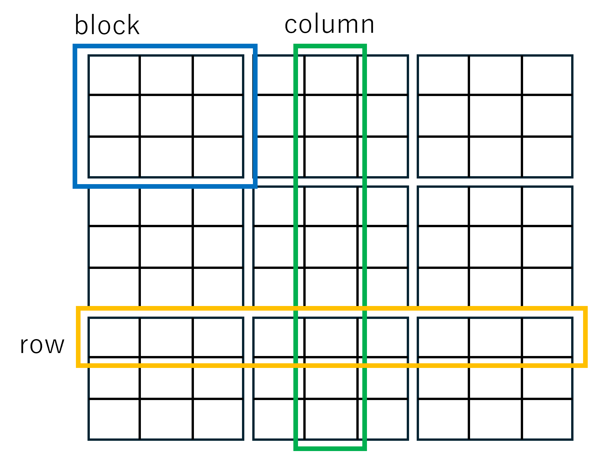

# Algorithm Design
:stem: latexmath

This section describes the algorithm design for solving the Number Place puzzle.
The approach involves using a backtracking algorithm to fill in the grid while following the game's rules.

## Backtracking Algorithm
### The core concept of the algorithm
The algorithm uses heuristics to make the search for a solution more efficient.
It performs a depth-first search to explore possible solutions.

1. Find an empty cell.
2. Generate possible candidate numbers.
* During generation, scan the rows and columns to narrow down numbers that do not cause logical contradictions.
3. Try each candidate one by one and check whether it leads to a valid solution.
4. If no solution is found, backtrack to the previous step and try another candidate.
5. If a valid solution is found, terminate the process.

### Method for deriving candidates
First, for each empty cell within a 3×3 block, the algorithm lists all numbers that have not yet been used in that block as candidates.
At this stage, every cell in the block has the same set of candidates.

Next, for each cell, any numbers that already exist in the same row or column are removed from the candidate list.
If a cell’s candidate list is reduced to a single value, that value is then removed from the candidate lists of other cells within the same block.

[cols="1a,1a" width="50%" frame="none"]
|===
|3x3 Block
[cols="^1,^1,^1" grid="none"]
!===
!1!2!3
!4!5!6
!(7,8,9)!(7,8,9)!(7,8,9)
!===
|Column Scan
[cols="^1,^1,^1" grid="none"]
!===
!1!2!3
!4!5!6
!(8)!(7,9)!(7,9)
!===
[cols="^1,^1,^1" grid="none"]
!===
!0!0!0
!0!0!0
!7!0!0
!===
[cols="^1,^1,^1" grid="none"]
!===
!0!0!0
!9!0!0
!0!0!0
!===
|===

### Backtracking details
From the remaining unsolved blocks, the algorithm selects the cell with the fewest candidates and tests each candidate one by one.
If multiple cells have the same number of candidates, one of them is selected at random.

When testing a candidate, the value is tentatively placed in the cell, and the candidate lists of the other cells are recalculated.
If any other cell’s candidate list becomes empty as a result, the current candidate is considered invalid, and the algorithm proceeds to try the next candidate.
If no candidate lists become empty, the algorithm moves on to the next cell.

When all cells are filled, a valid solution has been found.
If no solution is found after testing all candidates, the algorithm backtracks to the previous cell and tries a different candidate.
This process continues until a solution is discovered.

Determining whether multiple solutions exist would require continuing the search after the first solution is found to check for additional valid solutions; however, this feature is omitted in the current implementation.

## Data Structures and Functions
### Deriving candidates
Candidate derivation is performed by the `DeriveCandidates` function.
It scans all nine blocks, nine columns, and nine rows to narrow down the possible candidates.

#### Deriving
Each cell belonging to a block, row, or column stores a bit flag representing the candidates from 1 to 9.

The 2-byte bit flag uses the LSB to represent 1, the second bit to represent 2, and so on up to the ninth bit, which represents 9.
The remaining bits are filled with 0. This bit flag is referred to as the candidate byte.

Cells are classified into two types: “settled” and “pending.”
A settled cell has only one possible candidate, while a pending cell has multiple candidates.

The candidate byte of a settled cell is filled entirely with 0, whereas a pending cell’s candidate byte contains a nonzero value.
Each block, column, and row consists of both settled cells (filled with zeros) and pending cells (holding candidates).
All pending cells within the same block, column, or row share the same set of candidates.

Let stem:[x, y \in {1, \dots, 9}].
The candidates for the cell `(x, y)` are determined by
stem:[block[\lceil x/3\rceil, \lceil y/3\rceil\] \land col[x\] \land row[y\]].
If `(x, y)` is settled, its candidate set is empty.

#### Building
The intended data structure is a Collection list.
Each element is a tuple `(x, y, f)` , where x and y represent the cell coordinates, and f is a candidate value between 1 and 9 for that cell.

All cells whose candidate bytes are nonzero are scanned.
For each such cell, the values corresponding to the set bits in its candidate byte are extracted, and a tuple is created and added to the Collection.
Settled cells are skipped since their candidate bytes are zero.
The resulting list is then sorted so that cells with fewer candidates appear first.

### Backtracking
